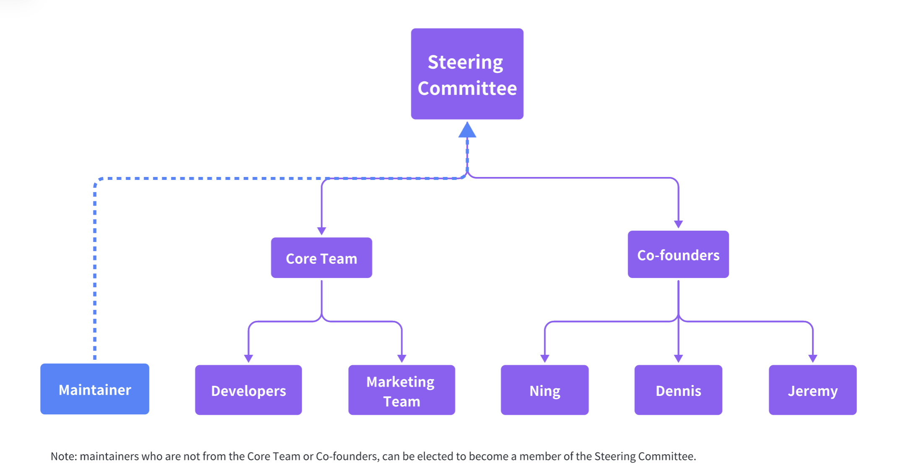
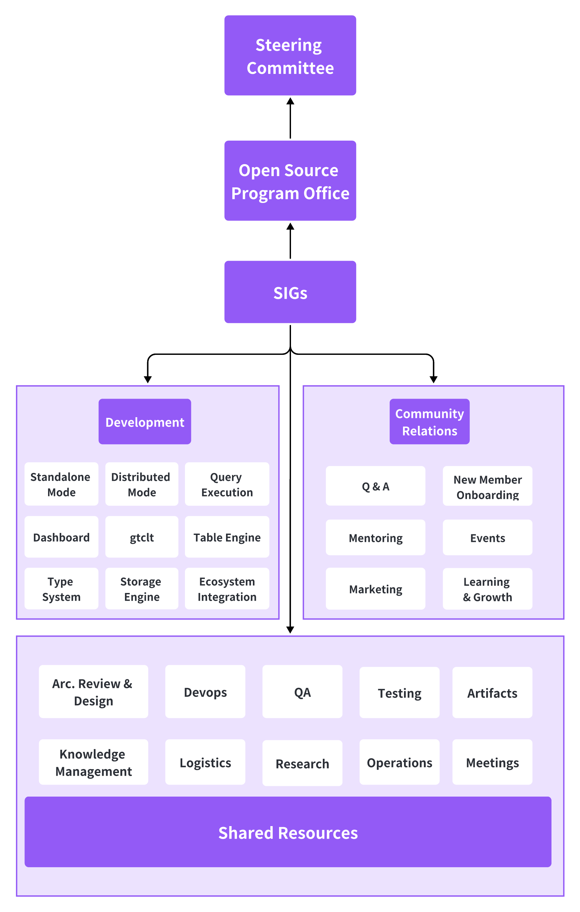
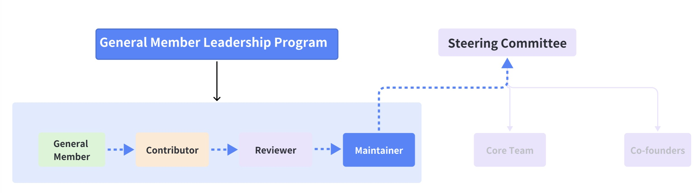

# GreptimeDB Community

We're excited to have you as a member of Greptime's community! GreptimeDB is a modern hybrid time series & analytical database. Whether you're a developer, architect, designer, technical writer, or just someone passionate about open-source projects, there's a place for you in our community.

This guide assists you in getting started with our community. We kindly request you to take a few moments to read through this document and become acquainted with our code of conduct, guidelines for contributing, and where to find additional resources.

We welcome you to share your ideas and help us build a vibrant and inclusive community.

## Governance

Governance is not bureaucracy, or endless processes and useless documentation, but alignment and expectation management. In order to promote collaboration across teams and create a good culture within the Greptime community, it's important to have documented governance so that members can build trust faster and focus on long-term sustainable growth of our community. This document is a work in progress. It describes and serves the current stage of Greptime community and will change and evolve as we grow.

You can submit a proposal of improvement by sending us an email community@greptime.com be sure to put the key word "proposal" in the subject; or join our Slack: https://greptime.com/slack to talk to a Steering Committee member, who has a purple icon next to his/her name. Greptime's Steering Committee will review proposals on a regular basis and update the status here: https://github.com/orgs/GreptimeTeam/projects/18/views/1

### Principles

The Greptime community adheres to the following principles:

**Openness**: we are determined to practice this principle through 3 stages, from open source to open discussion, ultimately leading to open decision making.

**Inclusiveness**: all members feel safe, respected, and comfortable in expressing all aspects of their thoughts and opinions. Our community is where each member shares a sense of belonging with its other members.

**Positivity**: the community acts as a support system for members when they require encouragement or help; furthermore, it inspires and encourages members to build positive and beneficial relationships with others.

_Note: The governance model for each of the 3 stages will be slightly different, but overall it is a process of going from a simple to a complete governance structure. As of now, we are mostly at the open source stage, but in the future, we will introduce appropriate structures at different stages, eventually evolving from being driven mainly by the Core Team to becoming a highly autonomous open source community._

### Code of Conduct

Greptime follows the [Apache Code of Conduct](https://www.apache.org/foundation/policies/conduct.html).
Instances of abusive, harassing, or otherwise unacceptable behavior may be reported by contacting community@greptime.com with the subject line "Code of Conduct Voilation".

### Roles & Responsibilities

**General Members**: anyone who follows and receives regular updates from Greptime. Not limited to: Starred Greptime on GitHub, joined Greptime's Slack, signed up for the maillist, newsletter, or followed Greptime's social media accounts.

**Contributors**: anyone who has raised issues, submitted and got their PRs merged. They can be developers, testers, quality assurance engineers, marketing teams or advocates* (see definition below), etc.

_Advocates*: assist in advocating for Greptime's open source projects and maintaining the community's culture through a series of online or offline activities. (Please use the hashtag #greptime if you are advocating on different social media platforms)_

**Reviewers**: ensure quality and consistency of submitted PRs.

**Maintainers**: has high authority over the project, responsible for code merging, testing and version releases.

**Sub-project Owner**: set direction and priorities for a sub-project; currently all 3 technical co-founders set direction and priorities together, with Greptime developers responsible for the development of each module or function. In the future, as the number of new requirements increases, the Steering Committee will elect Sub-project Owners to develop plans with 3 co-founders together.

### Org Chart

**Steering Committee**: responsible for key decision making of projects, determining project scope, release plan, milestones, community governance, and member election. Since Greptime's current team is not big, it's composed of Core Team and Greptime's 3 technical co-founders: Jeremy F., Dennis Z. and Ning S. (they are explicitly listed here to differentiate open source projects owned by Greptime, with foundation-owned open source projects). However, a Contributor can become a Steering Committee member through the General Member Leadership Program (see below).

**Open Source Programs Office (OSPO)**: we borrow the term "OSPO" but the definition is quite different, OSPO in Greptime is a team that manages, organizes, monitors and coordinates a group of Greptime open source sub-projects; it reports to the Steering Committee periodically. Currently, co-founder Jeremy F. is managing all technical sub-projects within the SIGs with the help from the marketing team managing all non-technical sub-projects. OSPO is only formed when a cross-team decision needs to be made, therefore, it only shows on the graph of Decision Escalation Path (see below).

**Core Team**: responsible for the operation, execution and maintenance of open source projects. Currently, Core Team includes Gretpime's full/part-time developers and marketing team members who are working for open source projects that are owned by Greptime.

### Special Interest Groups (SIGs)

Special Interest Groups (SIGs): responsible for the development and maintenance of particular modules or features, supporting and building healthy relations among community members and providing shared resources to support sub-projects. By this definition, SIGs are now divided into 3 groups including "Development" "Community Relations", "Shared Resources" and each group consists of sub-projects, see illustration below.

**Development**:

- Dashboard
- Distributed
- Query Engine
- Storage Engine
- Tools
- Ecosystem Integration (such as, PromQL, SQL, Python, Grafana, etc)
...etc.

**Community Relations**: provide timely technical and non-technical support to other members in the community by answering their questions; and facilitate new member onboarding, training, etc.

**Shared Resources**: centralized unit to provide functional support to all sub-projects within SIGs. It includes technical support, such as Devops, Testing, Quality Assurance (QA) and Architecture Design & Review (ADR); and non-technical support, such as project artifacts, tools, research, operations, knowledge management, meetings, etc.

### Decision Escalation Path

## Communications

Since GreptimeDB is still in its early stages, as of now, we are maintaining only one official group on Slack. Besides the # general channel, we also invite contributors to a private # contributor channel.

* **Contributor Channel** where developers and contributors communicate through text-based meetings, bi-weekly Office Hours, questionnaires, meetups, etc. We hope this group can promote collaborations and exchange ideas between Greptime's team of developers and contributors who are interested in building an amazing TSDB together!
The discussion will cover various topics, including:

  * Gathering new requirements
  * Discussing issues with GreptimeDB products
  * Sharing technical knowledge
  * Announcing the latest releases and private previews
  * Demonstrating new features
  * Responding to any questions
  * And more

To foster a respectful and inclusive community, as well as enhance communication, we hope that every member can adhere to the guidelines and etiquette of our group discussions:

1. **Don’t add someone to a channel without letting them know**: A contributor is someone who has contributed to Greptime GitHub projects. To avoid confusion, let someone know before adding them to a channel and clarify their responsibilities.

2. **Be careful with @channel or @everyone all the time**: When you @channel, everyone who is in the channel will get a notification. With @everyone, all members of the general channel will be notified. You can prevent misunderstandings and confusion by only @mentioning or DM the people who need to see your message.

3. **Do write to be understood**: Please try to write your entire point within one message, use direct, succinct language, or bullet points and numbers given the asynchronous nature of Slack.

4. **Use threads to maintain conversation flow**: We encourage you to reply directly to topics and messages that are relevant to you by using Slack threads. Replying within a thread helps to keep the channel organized and maintain control of the workspace.

5. **Customize your Slack notifications**: As we have contributors located in different timezones, we respect everyone's work style. If you would rather not be interrupted, we kindly request that you update your status accordingly or clearly communicate your designated working hours so that others may be informed.

## General Member Leadership Program

A General Member can become a Contributor by getting their PRs successfully merged into GreptimeDB's main branch in GitHub.

A responsive Contributor can become a **Reviewer** by emailing community@greptime.com with the key word "Apply to be a Reviewer" in the subject line, and the Steering Committee will make the final decision and publish the result on the Bi-weekly Report before officially assigning any PRs to the selected Reviewer.

A **Maintainer** is a highly experienced and active Reviewer and can apply to become a member of the Steering Committee by following these steps:

1. Receive email sponsorship by at least two existing members of the Steering Committee.
2. Forward the email to community@greptime.com with the key word "Apply to be a Steering Committee member" in the subject line
3. The Steering Committee goes through the Voting Process.
4. The OSPO publishes the decision in the form of meeting minutes and posts it publically.

### Membership Benefits Program

Currently, all Contributors receive Greptime's swag and will be mentioned in every Bi-weekly Report published on the official website under Blogs: https://greptime.com/blogs/

Reviewers and Maintainers inherit all benefits of Contributors, additional benefits are pending. We encourgage you to email us and let us know what makes you feel encouraged to contribute in a community.

## Resources

* [Events](events/)

We are happy to see you participate in any way that suits you. If you encounter any difficulties or problems, do not hesitate to ask for help by submitting an issue with a detailed explanation of what you attempted to do and where the problem arose. If you have any inquiries or wish to become part of our community, please visit:

* [GreptimeDB Community Slack](https://greptime.com/slack)
* [GreptimeDB GitHub Discussions](https://github.com/GreptimeTeam/greptimedb/discussions)

Also, check out some additional content for GreptimeDB:

* [GreptimeDB Docs](https://greptime.com/docs)
* [Learn GreptimeDB](https://greptime.com/products/db)
* [Greptime Inc. Website](https://greptime.com/)

## License

GreptimeDB Community is under the Apache 2.0 license. See the [LICENSE](./LICENSE) file for details.
